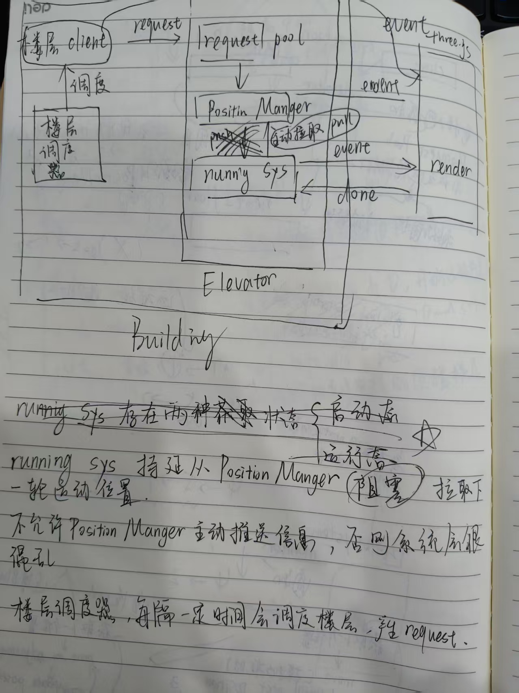

# README

电梯调度算法的模拟实现

整套系统最终运行效果如下：

整体为前后端分离, 前端通过three.js实现3D可视化, 后端通过Java实现电梯调度算法.

因为我不太熟悉three.js, 所以前端大框架是由deepseek负责生成, 我负责将其和我的后端进行对接, 因此各位码友可以看到大量日志信息

> deepseek真的吊，我就说了我的想法一次，ds就生成了一个我能立刻使用的demo前端

于后端而言, 整体架构如下图所示

> 凑活着看吧，以后找个时间用计算机画个更专业的图

后端总共可以分为一下几个模块

- FloorClient，在我的电梯调度系统中，我将**每个楼层**抽象成一个`客户端`，客户端内会随机刷新若干NPC，按下电梯按键，通知电梯运行到所属楼层，并运载NPC到目标楼层
- FloorRequst，NPC通知电梯的过程被我抽象为`发出请求`，通过请求的方式通知电梯

- Elevator，电梯系统，负责将内部组件按照顺序组合，同时对外提供Connection连接，允许FloorClient发送FloorRequset
  - RequestPool（坚持rp），这没啥好说的，就是承载FloorRequest的容器。该容器会被`调度器`定时`flush`，通知PositionManager处理
  - PositionManager（简称pm），核心组件，用于规划电梯的运行轨迹。内部用的是我基于`插入算法`搞出得一套计算方式，引入的`红蓝颜色`（RedBlueBall）。这个算法说起来比较麻烦，大伙感兴趣就看我的bilibili视频把
  - RunningSystem，核心组件，用于控制电梯运行。该组件会监控PositionManager，持续从pm中获取电梯下一个到站点，同时负责通知前端播放对应动画，控制画面移动
- Building，更大一层及的组合类，其中囊括FloorClient和Elevator，在封装内部细节的同时，对外暴露借口，方便其他组件影响Building内部属性
- Schedulor，调度器，是上图**楼层调度器**的变种。在早期**楼层调度器是包含在Building内的**，后来发现他的功能需要拓展，便将其从Building中剥离，独立存在。调度器负责定时调度**FloorClient**，**RequestPool**，让他们被动产生楼层请求，刷新缓冲池并通知电梯处理。可以说没有Schedulor，整套系统就无法正常运作，因为缺少触发事件

最后在吐槽一点，md，js后端真难用，尤其是那个多线程。原本我是用js写的，但后来发现必须得前后端分离，搞了半天，棒槌
